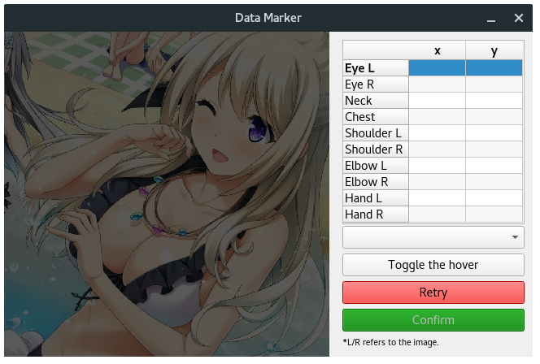
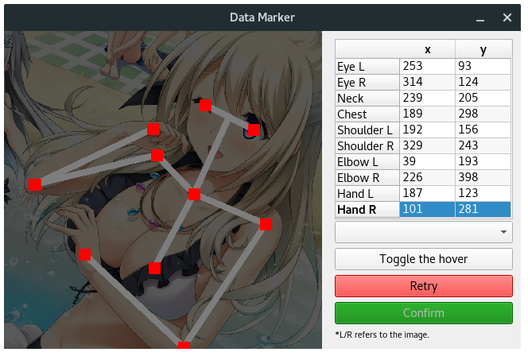
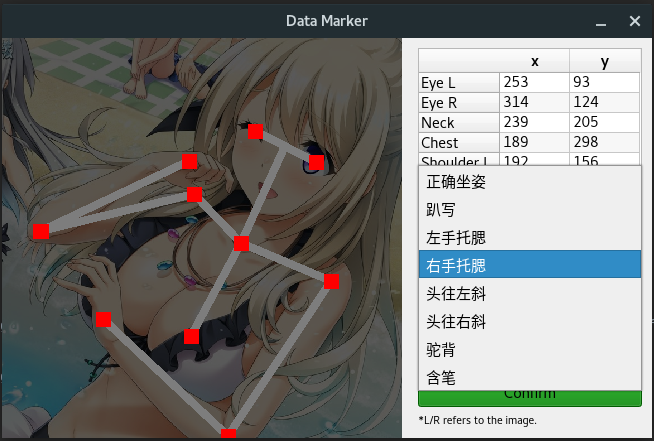
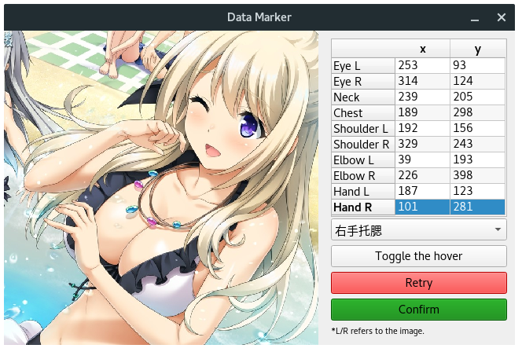
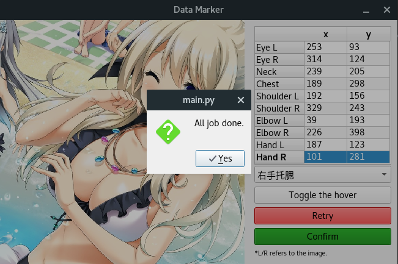

# Data Marker

 

It's a GUI application for data marking (human sitting posture) efficiently.

## How to Use

### Preparation

#### Requirements

Use ```pip3``` install ```PyQt5``` for UI. Run this:

```shell
pip3 install PyQt5 --user
```

#### Directory Formatting

Make sure **you have already made path of your unmarked images like this**:

```plain-text
data-marker
├── dataset
│   └── unmarked
│       ├── test00.jpg
│       ├── test01.jpg
│       ├── test02.jpg
│       └── ......
├── main.py
└── ......
```

### Launch

Run ```main.py``` in shell:

```shell
python3 main.py
```

Or make it executable:

```shell
chmod +x main.py
./main.py
```

### Running



#### Joints Marking

You should click on the image **following the joints sequence in the table**. Once you click on the image, the coordinate of the pixel you click will be displayed in the data table.

Click the 'Retry' button with red background to revert all marking points in current image.



#### Category Marking

Click the ComboBox below the data table and select a category of sitting posture.



#### Toggle On/Off the Hover

Click the 'toggle' button to toggle on/off the joints hover.



#### Confirm the Marking

Click the 'confirm' button to confirm your data marking of current image. After that, here comes another image and last image will be moved to a new directory called ```marked```. Of course, the marking data will be stored in a csv file called ```data.csv```.

The fields of the csv file:

| filename | Eye-L x | Eye-L y | Neck x | Neck y | Chest x | Chest y | Shoulder-L x | Shoulder-L y | Shoulder-R x | Shoulder-R y | Elbow-L x | Elbow-L y | Elbow-R x | Elbow-R y | Hand-L x | Hand-L y | Hand-R x | Hand-R y | Category ID |
|:-:|:-:|:-:|:-:|:-:|:-:|:-:|:-:|:-:|:-:|:-:|:-:|:-:|:-:|:-:|:-:|:-:|:-:|:-:|:-:|
| | | | | | | | | | | | | | | | | | | | | |


#### Finish Tasks

Once you finish data marking tasks on all of the unmarked images, a dialog will show up.



###

